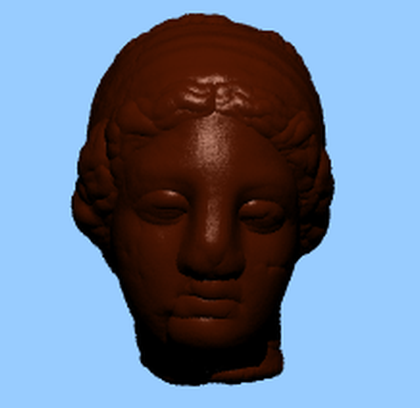

# Rendering-Master-Project

This is a ray tracer implemented as part of the master project at the University of Freiburg. The ray tracer is an extension of the old ray tracer used in the <a href="https://github.com/Alhajras/Raytracer/blob/main/lab_report_1/lab_report_1.pdf">rendering lab</a>.The report of the work done can be found <a href="/Report/report.pdf">here</a>. In order to run the code, run this command in the root directory:

```
g++ -o output main.cpp
```
and then run the output file as
```
./output
```
This will start rendering a `sanford bunny` by using `BVH`.

Next are some of the renderd results:

| showcase 1 | showcase 2 | showcase 3 | showcase 4 |
| --------  | ------------------- | --------------------- |---------------------|
| |       |  |  |

| showcase 5 | showcase 6|
| --------  | ------------------- |
|  |  |

| showcase 7 | showcase 8 | showcase 9 |
| --------  | --------------- | ------------------- |
| .PNG)|   |   |


In the <a href="/project/raytracer/settings.h">settings</a> file one can change the ray tracer configuration, most important configurations are:

```
width: Width of the scene, default value is 640
height: Height of the scene, default value is 480
backgroundColor: Standard bg color. default value is white
aa_samples: Anti aliasing samples, default value is 1
dataStructure: options are (BVH, KDTREE, LBVH, NONE), default value is BVH
sceneModel: Model from the models in the models directory, default value is the Bunny
```

There is a bug where the space between primitives increased but by using the bisect I have found that it started from this commit: `0a261fd3418f82cf09f6b291786ee5b2d71f68ba`

## Thanks to
1. Online course offerd by Dr.-Ing. Matthias Teschner [Computer Graphics](https://cg.informatik.uni-freiburg.de/teaching.htm)
1. [Ray Tracing in One Weekend](https://raytracing.github.io/books/RayTracingInOneWeekend.html)
1. [Scratchapixel](https://www.scratchapixel.com/) for properly explaining all the concepts and the [AABB](https://www.scratchapixel.com/lessons/3d-basic-rendering/minimal-ray-tracer-rendering-simple-shapes/ray-box-intersection) implementation.
1. The grass texture in `textures` was taken from https://3djungle.net/textures/grass/1417/.
1. The Stanford dragon, and Happy Buddha were taken from https://casual-effects.com/data/
1. The Stanford XYZ dragon, Stanford bunny, Stanford Lucy and were taken from https://github.com/alecjacobson/common-3d-test-models
1. The Trees model was taken from https://free3d.com/3d-model/trees-9-53338.html
1. Sci-Fi model is taken form https://free3d.com/3d-model/sci-fi-tropical-city-25746.html 
